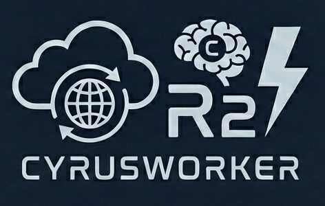

<p align="center">
  
</p>

# CyrusWorker

Run [Cyrus Community Edition](https://github.com/ceedaragents/cyrus) (Claude Code-powered Linear agent) on Cloudflare's edge infrastructure using the Sandbox SDK.

Inspired by [Moltworker](https://github.com/cloudflare/moltworker).

## Why CyrusWorker?

Instead of running Cyrus Community Edition on a local Mac mini or VPS:

- **No hardware required** - Runs in Cloudflare Sandbox containers
- **Always on** - Auto-bootstraps on first webhook, sleeps when idle to save compute
- **Global edge** - Low latency webhook processing worldwide
- **Persistent storage** - R2 backup of config, tokens, and repo URLs
- **Secure** - Webhook signature verification protects endpoints
- **PHI-conscious** - Minimizes logging of Linear issue content (see [CLAUDE.md](./CLAUDE.md#hipaaphi-considerations))

## Requirements

- [Workers Paid plan](https://www.cloudflare.com/plans/developer-platform/) ($5/month) - Required for Sandbox
- [Anthropic API key](https://console.anthropic.com/) - For Claude Code
- [GitHub PAT](https://github.com/settings/tokens) - For PR creation
- Linear workspace with admin access

## Quick Start

[](https://deploy.workers.cloudflare.com/?url=https://github.com/brianleach/cyrusworker)

Or manually:

```bash
# Clone and install
git clone https://github.com/brianleach/cyrusworker.git
cd cyrusworker
npm install

# Deploy (requires Docker running)
npm run deploy
```

After deployment, note your worker URL (e.g., `https://cyrusworker.your-subdomain.workers.dev`).

## Connecting to Linear

Cyrus uses Linear's **OAuth Applications** with **Agent Session Events** - not standard webhooks.

### Step 1: Create a Linear OAuth Application

1. Go to **Linear Settings → API → OAuth Applications**
2. Click **Create new OAuth Application**
3. Fill in:
   - **Name**: `Cyrus` (this is how it appears in Linear)
   - **Callback URL**: `https://your-worker.workers.dev/callback`
4. Enable these toggles:
   - ✅ **Client credentials**
   - ✅ **Webhooks**
5. Configure webhook settings:
   - **Webhook URL**: `https://your-worker.workers.dev/webhook`
   - **App events**: ✅ **Agent session events** (required - makes Cyrus appear as an agent)
6. Save and copy these credentials:
   - **Client ID**
   - **Client Secret** (only shown once!)
   - **Webhook Signing Secret** (from webhook settings)

### Step 2: Set Secrets

```bash
# Linear OAuth credentials
npx wrangler secret put LINEAR_CLIENT_ID
npx wrangler secret put LINEAR_CLIENT_SECRET
npx wrangler secret put LINEAR_WEBHOOK_SECRET

# Claude Code
npx wrangler secret put ANTHROPIC_API_KEY

# GitHub (for PR creation)
npx wrangler secret put GH_TOKEN
npx wrangler secret put GIT_USER_NAME
npx wrangler secret put GIT_USER_EMAIL

# Admin UI protection (generate a random token)
export GATEWAY_TOKEN=$(openssl rand -hex 32)
echo "Save this token: $GATEWAY_TOKEN"
echo "$GATEWAY_TOKEN" | npx wrangler secret put GATEWAY_TOKEN
# Treat this token like a password - anyone with it can access your Admin UI
```

### Step 3: Authorize Cyrus with Linear

Visit the authorization URL (replace with your values):

```
https://linear.app/oauth/authorize?client_id=YOUR_CLIENT_ID&redirect_uri=https://YOUR_WORKER.workers.dev/callback&response_type=code&scope=write,app:assignable,app:mentionable&actor=app
```

You should see "Authorization Complete!" with your organization name.

### Step 4: Add a Repository

Open the Admin UI at `https://your-worker.workers.dev/_admin/?token=YOUR_GATEWAY_TOKEN` and use the "Add Repository" form, or via API:

```bash
curl -X POST "https://your-worker.workers.dev/api/add-repo?token=YOUR_GATEWAY_TOKEN" \
  -H "Content-Type: application/json" \
  -d '{"url": "https://github.com/your-org/your-repo.git"}'
```

### Step 5: Delegate an Issue

In Linear, open any issue and click **Delegate to... → Cyrus**. Cyrus will process the issue using Claude Code.

## How It Works

1. User **delegates** an issue to Cyrus or **@mentions** it in a comment
2. Linear sends an `AgentSessionEvent` webhook to your worker
3. Worker checks if Cyrus is running; if not, **auto-bootstraps** (restores config from R2, clones repos, starts Cyrus)
4. Worker forwards the webhook to Cyrus EdgeWorker (port 3456)
5. Cyrus processes the issue using Claude Code
6. Results are posted back to Linear

**Note**: Cyrus appears as a delegatable agent in Linear's "Delegate to..." menu, not as a regular user in the assignee list.

## Admin UI

The Admin UI is protected by the `GATEWAY_TOKEN` set in [Step 2](#step-2-set-secrets). Access it at:

```
https://your-worker.workers.dev/_admin/?token=YOUR_GATEWAY_TOKEN
```

Features:
- **Cyrus Status** - View status (idle/busy/offline), version, repo count
- **Repositories** - List configured repos, add new repos
- **Logs** - View Cyrus EdgeWorker logs
- **Storage** - Save/restore config to R2
- **Bootstrap** - Manually trigger bootstrap
- **Execute** - Run commands in the sandbox

## API Endpoints

All `/api/*` endpoints require the `GATEWAY_TOKEN` query parameter (e.g., `/api/status?token=YOUR_TOKEN`).

| Endpoint | Method | Description |
|----------|--------|-------------|
| `/health` | GET | Health check |
| `/webhook` | POST | Linear AgentSessionEvent receiver (auto-bootstraps) |
| `/callback` | GET | Linear OAuth callback |
| `/api/bootstrap` | POST | Full bootstrap: restore, clone repos, start Cyrus |
| `/api/status` | GET | Sandbox process and disk status |
| `/api/config` | GET | Current Cyrus config |
| `/api/init` | POST | Initialize Cyrus .env from Worker secrets |
| `/api/start` | POST | Start Cyrus EdgeWorker |
| `/api/add-repo` | POST | Add repository (`{url, workspace?}`) |
| `/api/restore` | POST | Restore config from R2 |
| `/api/save` | POST | Save config to R2 |
| `/api/exec` | POST | Execute command in sandbox |
| `/api/backup` | POST | Backup full ~/.cyrus to R2 |
| `/_admin/` | GET | Admin UI |

## Secrets Reference

| Secret | Required | Description |
|--------|----------|-------------|
| `LINEAR_CLIENT_ID` | Yes | Linear OAuth Application client ID |
| `LINEAR_CLIENT_SECRET` | Yes | Linear OAuth Application client secret |
| `LINEAR_WEBHOOK_SECRET` | Yes | Linear OAuth Application webhook signing secret |
| `ANTHROPIC_API_KEY` | Yes | Claude API key for Claude Code |
| `GH_TOKEN` | Yes | GitHub PAT for PR creation |
| `GIT_USER_NAME` | Yes | Git commit author name |
| `GIT_USER_EMAIL` | Yes | Git commit author email |
| `GATEWAY_TOKEN` | Recommended | Token to protect Admin UI access |
| `GIT_SSH_PRIVATE_KEY` | No | SSH private key for private repos |

### Where to Get Each Secret

#### LINEAR_CLIENT_ID / LINEAR_CLIENT_SECRET / LINEAR_WEBHOOK_SECRET

From your Linear OAuth Application (see [Step 1](#step-1-create-a-linear-oauth-application)).

#### ANTHROPIC_API_KEY

1. Go to [Anthropic Console](https://console.anthropic.com/)
2. Navigate to **API Keys**
3. Click **Create Key**
4. Copy the key (starts with `sk-ant-`)

#### GH_TOKEN

1. Go to [GitHub Settings → Developer settings → Personal access tokens → Fine-grained tokens](https://github.com/settings/tokens?type=beta)
2. Click **Generate new token**
3. Under **Repository access**, select the repos Cyrus should access
4. Under **Permissions → Repository permissions**, enable:
   - **Contents**: Read and write
   - **Pull requests**: Read and write
   - **Metadata**: Read-only
5. Click **Generate token**

#### GIT_USER_NAME / GIT_USER_EMAIL

Used for git commits:
```bash
npx wrangler secret put GIT_USER_NAME   # e.g., "Cyrus"
npx wrangler secret put GIT_USER_EMAIL  # e.g., "cyrus@your-domain.com"
```

## Private Repository Access

### Option 1: GitHub PAT (HTTPS) - Recommended

The `GH_TOKEN` handles HTTPS authentication automatically.

### Option 2: SSH Key

```bash
# Generate a deploy key
ssh-keygen -t ed25519 -C "cyrus@your-domain.com" -f cyrus-key -N ""

# Add cyrus-key.pub as a deploy key in your GitHub repo
# Then set the private key
npx wrangler secret put GIT_SSH_PRIVATE_KEY < cyrus-key
```

## Local Development

```bash
# Create .dev.vars with secrets
cp .dev.vars.example .dev.vars

# Start dev server (requires Docker)
npm run dev
```

## Architecture

See [CLAUDE.md](./CLAUDE.md) for detailed architecture documentation.

## Troubleshooting

### Cyrus doesn't appear in Linear's "Delegate to..." menu

- Verify **Agent session events** is enabled in your OAuth Application
- Ensure you completed the OAuth authorization flow
- Check that the webhook URL is correct and responding

### Linear says "did not respond" or Cyrus fails to fetch issue details

This usually means the OAuth token in Cyrus's config is stale. To fix:

1. Open Admin UI and click **Bootstrap** - this syncs the fresh token from storage to Cyrus
2. If that doesn't work, click **Reauthorize** to get a completely new token, then **Bootstrap**

You can verify the token is working by running this in Execute:
```bash
cat /root/.cyrus/config.json | grep linearToken
```
Then test it:
```bash
curl -s -H "Authorization: Bearer YOUR_TOKEN_HERE" https://api.linear.app/graphql \
  -H "Content-Type: application/json" -d '{"query":"{ viewer { id } }"}'
```

### Webhooks aren't being received

- Check webhook URL matches your worker: `https://your-worker.workers.dev/webhook`
- Verify `LINEAR_WEBHOOK_SECRET` matches the signing secret in Linear
- Check worker logs: `npm run tail`

### Authorization fails

- Ensure `LINEAR_CLIENT_ID` and `LINEAR_CLIENT_SECRET` are set correctly
- Check the callback URL matches: `https://your-worker.workers.dev/callback`

### Repository cloning fails

- Verify `GH_TOKEN` has access to the repository
- Check the repository URL is correct (HTTPS format)
- View logs in Admin UI for detailed error messages

## License

MIT
